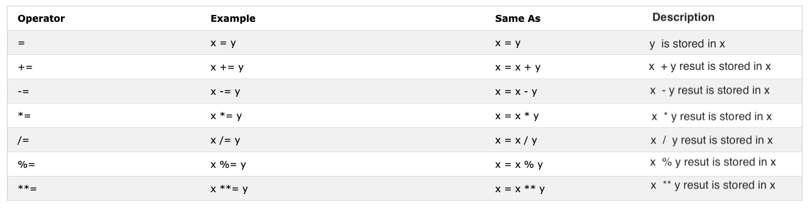

# EXPRESSIONS AND OPERATORS

Types of Operators in JS
1. Assignment operators
2. Arithmetic operators
3. Comparison operators
4. Logical operators
5. String operators
6. Conditional (ternary) operator
7. In arithmetic we increment and decrement operator.

# Assignment operators

Assignment operators in programming are symbols used to assign values to variables. They take the value on the right side of the operator and assign it to the variable on the left side.
```js
// examples
let myFavNum1 = 15;
console.log(myFavNum1);
```
# Arithmetic operators.

Arithmetic operators in programming perform basic mathematical operations on variables or values. They include addition, subtraction, multiplication, division, and modulus.

- Addition(+): a + b
- Subtraction(-): a - b
- Multiplication(*): a * b
- Division(/): a / b
- Modulus(%): a % b
- Exponential(**): a ** b



## Addition (+): Adds two values or variables.
```js
var x = 5;
var y = 10;
var sum = x + y;
console.log(sum);
```
## Subtraction (-): Subtracts the right operand from the left operand.
 ```js
 var a = 10;
 var b = 7;
 var difference = a - b;
 console.log(difference);
```
## Multiplication (*): Multiplies two values or variables.
 ```js
 var p = 4;
 var q = 6;
 var product = p * q;
 console.log(product);
```
## Division (/): Divides the left operand by the right operand.
```js
var m = 15;
var n = 3;
var quotient = m / n;
console.log(quotient);
```
## Modulus (%): Returns the remainder when the left operand is divided by the right operand.
```js
var c = 17;
var d = 5;
var remainder = c % d;
console.log(remainder);
```
# Comparison Operators

In programming we compare values, we use comparison operators to compare two values. We check if a value is greater or less or equal to other value.


## Equal (==): Checks if two values are equal, performing type coercion if necessary.
```js
console.log(5 == "5");
```
## Strict Equal (===): Checks if two values are equal without performing type coercion.
```js
console.log(5 === "5");
```
## Not Equal (!=   👉 ! =):Checks if two values are not equal, performing type coercion if necessary.
```js
console.log(5 != 5);
```
## Greater Than (>):Checks if the value on the left is greater than the value on the right.
```js
 Example: 10 > 5 evaluates to true.
console.log(5 > 2);
```
## Less Than (<):Checks if the value on the left is less than the value on the right.
```js
// Example: 5 < 10 evaluates to true.
console.log(5 < 10);
```
## Greater Than or Equal To (>=):Checks if the value on the left is greater than or equal to the value on the right.#
```js
// Example: 10 >= 10 evaluates to true.
console.log(10 <= 10);
```
## Less Than or Equal To (<=):Checks if the value on the left is less than or equal to the value on the right.
```js
// Example: 5 <= 10 evaluates to true.

// console.log(5 >= 10);
```
```js
console.log(3 > 2)              // true, because 3 is greater than 2
console.log(3 >= 2)             // true, because 3 is greater than 2
console.log(3 < 2)              // false,  because 3 is greater than 2
console.log(2 < 3)              // true, because 2 is less than 3
console.log(2 <= 3)             // true, because 2 is less than 3
console.log(3 == 2)             // false, because 3 is not equal to 2
console.log(3 != 2)             // true, because 3 is not equal to 2
console.log(3 == '3')           // true, compare only value
console.log(3 === '3')          // false, compare both value and data type
console.log(3 !== '3')          // true, compare both value and data type
console.log(3 != 3)             // false, compare only value
console.log(3 !== 3)            // false, compare both value and data type
console.log(0 == false)         // true, equivalent
console.log(0 === false)        // false, not exactly the same
console.log(0 == '')            // true, equivalent
console.log(0 == ' ')           // true, equivalent
console.log(0 === '')           // false, not exactly the same
console.log(1 == true)          // true, equivalent
console.log(1 === true)         // false, not exactly the same
console.log(undefined == null)  // true
console.log(undefined === null) // false
console.log(NaN == NaN)         // false, not equal
console.log(NaN === NaN)        // false
console.log(typeof NaN)         // number

console.log('mango'.length == 'avocado'.length)  // false
console.log('mango'.length != 'avocado'.length)  // true
console.log('mango'.length < 'avocado'.length)   // true
console.log('milk'.length == 'meat'.length)      // true
console.log('milk'.length != 'meat'.length)      // false
console.log('tomato'.length == 'potato'.length)  // true
console.log('python'.length > 'dragon'.length)   // false
```

Try to understand the above comparisons with some logic. Remembering without any logic might be difficult.
JavaScript is some how a wired kind of programming language. JavaScript code run and give you a result but unless you are good at it may not be the desired result.

As rule of thumb, if a value is not true with == it will not be equal with ===. Using === is safer than using ==.


# Logical Operators

The following symbols are the common logical operators:

&&(ampersand) , ||(pipe) and !(negation).

The && operator gets true only if the two operands are true.

The || operator gets true either of the operand is true.

The ! operator negates true to false and false to true.

```js
// && ampersand operator example
// Logical AND (&&): Returns true if both operands are true, otherwise, it returns false.

const check = 4 > 3 && 10 > 5         // true && true -> true
const check = 4 > 3 && 10 < 5         // true && false -> false
const check = 4 < 3 && 10 < 5         // false && false -> false

// || pipe or operator, example
//Logical OR (||): Returns true if at least one of the operands is true, otherwise, it returns false.

const check = 4 > 3 || 10 > 5         // true  || true -> true
const check = 4 > 3 || 10 < 5         // true  || false -> true
const check = 4 < 3 || 10 < 5         // false || false -> false

//! Negation examples
// Returns true if the operand is false, and false if the operand is true.

let check = 4 > 3                     // true
let check = !(4 > 3)                  //  false
let isLightOn = true
let isLightOff = !isLightOn           // false
let isMarried = !false                // true
```

# Unary operator
Unary operators in JavaScript are operators that work with only one operand. They perform various operations such as negation, incrementing, decrementing, type conversion, and more.

## Unary Plus (+): Converts its operand into a number. If the operand is not already a number, it attempts to convert it.
```js
console.log(+3);
console.log(+"5");
```
## Unary Negation (-): Negates its operand, converting non-numbers into numbers and then negating them.
```js
console.log(-5);
console.log(-"3");
```
## Prefix Increment (++x) and Prefix Decrement (--x): In prefix form, the value of the operand is first incremented or decremented, and then the result is returned.
```js
var x = 5;
var y = --x;
console.log(y);
console.log(x);
```
## Postfix Increment (x++) and Postfix Decrement (x--): In postfix form, the value of the operand is first returned, and then it is incremented or decremented.
```js
// var x = 5;
// var y = x++;
// console.log(y);
// console.log(x);
```
The current value of x (which is 5) is assigned to y. After the assignment, the value of x is then incremented by 1.

# Conditional (ternary) operator
```js
syntax: condition ? expressionIfTrue : expressionIfFalse;
```
write a program to check if the candidates isEligibleForDrive or not? Age must be equal to or greater then 18.
```js
var age = 19;
var result = age >= 18 ? "Yes" : "No";
console.log(result);
```
Q: Let say you have a variable score representing a student's exam score. If the score is greater than or equal to 60, the student passes; otherwise, they fail. Use the conditional (ternary) operator to determine the result and store it in a variable called result. Log the result to the console❓
```js
var score = 99;
var result = score >= 60 ? "Pass" : "Fail";
console.log(result);
```
##  Combined Interview Questions
```js
console.log(typeof ("5" - 3));
console.log("5" - 3);

console.log(2 < 12 < 5);

console.log("20" + 10 + 10);
```
### Increment Operator

In JavaScript we use the increment operator to increase a value stored in a variable. The increment could be pre or post increment. Let us see each of them:

1. Pre-increment

```js
let count = 0
console.log(++count)        // 1
console.log(count)          // 1
```

1. Post-increment

```js
let count = 0
console.log(count++)        // 0
console.log(count)          // 1
```

We use most of the time post-increment. At least you should remember how to use post-increment operator.

### Decrement Operator

In JavaScript we use the decrement operator to decrease a value stored in a variable. The decrement could be pre or post decrement. Let us see each of them:

1. Pre-decrement

```js
let count = 0
console.log(--count) // -1
console.log(count)  // -1
```

2. Post-decrement

```js
let count = 0
console.log(count--) // 0
console.log(count)   // -1
```

# Ternary Operators

Ternary operator allows to write a condition.
Another way to write conditionals is using ternary operators. Look at the following examples:

```js
let isRaining = true
isRaining
  ? console.log('You need a rain coat.')
  : console.log('No need for a rain coat.')
isRaining = false

isRaining
  ? console.log('You need a rain coat.')
  : console.log('No need for a rain coat.')
```

```sh
You need a rain coat.
No need for a rain coat.
```

```js
let number = 5
number > 0
  ? console.log(`${number} is a positive number`)
  : console.log(`${number} is a negative number`)
number = -5

number > 0
  ? console.log(`${number} is a positive number`)
  : console.log(`${number} is a negative number`)
```

```sh
5 is a positive number
-5 is a negative number
```
# Operator Precedence

I would like to recommend you to read about operator precedence from this [link](https://developer.mozilla.org/en-US/docs/Web/JavaScript/Reference/Operators/Operator_Precedence)


### Truthy values

- All numbers(positive and negative) are truthy except zero
- All strings are truthy except an empty string ('')
- The boolean true

### Falsy values

- 0
- 0n
- null
- undefined
- NaN
- the boolean false
- '', "", ``, empty string

### Exercises: Level 1

 Declare firstName, lastName, country, city, age, isMarried, year variable and assign value to it and use the typeof operator to check different data types.
2. Check if type of '10' is equal to 10
3. Check if parseInt('9.8') is equal to 10
4. Boolean value is either true or false.
   1. Write three JavaScript statement which provide truthy value.
   2. Write three JavaScript statement which provide falsy value.

5. Figure out the result of the following comparison expression first without using console.log(). After you decide the result confirm it using console.log()
   1. 4 > 3
   2. 4 >= 3
   3. 4 < 3
   4. 4 <= 3
   5. 4 == 4
   6. 4 === 4
   7. 4 != 4
   8. 4 !== 4
   9. 4 != '4'
   10. 4 == '4'
   11. 4 === '4'
   12. Find the length of python and jargon and make a falsy comparison statement.

6. Figure out the result of the following expressions first without using console.log(). After you decide the result confirm it by using console.log()
   1. 4 > 3 && 10 < 12
   2. 4 > 3 && 10 > 12
   3. 4 > 3 || 10 < 12
   4. 4 > 3 || 10 > 12
   5. !(4 > 3)
   6. !(4 < 3)
   7. !(false)
   8. !(4 > 3 && 10 < 12)
   9. !(4 > 3 && 10 > 12)
   10. !(4 === '4')
   11. There is no 'on' in both dragon and python
